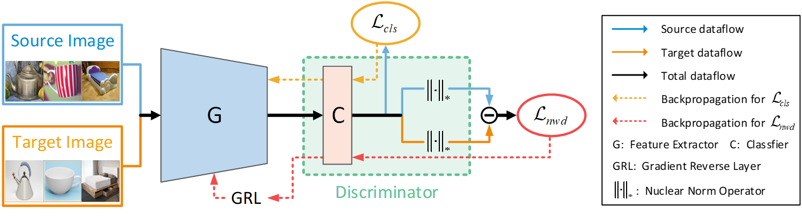

# DALN
[](https://paperswithcode.com/sota/domain-adaptation-on-imageclef-da?p=reusing-the-task-specific-classifier-as-a)
[](https://paperswithcode.com/sota/domain-adaptation-on-office-31?p=reusing-the-task-specific-classifier-as-a)
[](https://paperswithcode.com/sota/domain-adaptation-on-office-home?p=reusing-the-task-specific-classifier-as-a)
[](https://paperswithcode.com/sota/domain-adaptation-on-visda2017?p=reusing-the-task-specific-classifier-as-a)

This repo is the official PyTorch implementation of "Reusing the Task-specific Classifier as a Discriminator: Discriminator-free Adversarial Domain Adaptation".


### [[Paper]](https://openaccess.thecvf.com/content/CVPR2022/html/Chen_Reusing_the_Task-Specific_Classifier_as_a_Discriminator_Discriminator-Free_Adversarial_Domain_CVPR_2022_paper.html)
By [Lin Chen](https://scholar.google.com/citations?user=-t92FH8AAAAJ&hl=zh-CN&oi=sra), Huaian Chen, [Xin Jin](https://scholar.google.com/citations?hl=en&user=byaSC-kAAAAJ), Zhixiang Wei

## News
### 2022.09.15 We are happy to announce that our new work [DDB](https://github.com/xiaoachen98/DDB.git) was accepted at NeurIPS2022✨
### 2022.09.15 Release core code on github!

## Abstract
Adversarial learning has achieved remarkable performances for unsupervised domain adaptation (UDA). 
Existing adversarial UDA methods typically adopt an additional discriminator to play the min-max game with a feature extractor. 
However, most of these methods failed to effectively leverage the predicted discriminative information, and thus cause mode collapse for generator.
In this work, we address this problem from a different perspective and design a simple yet effective adversarial paradigm in the form of a discriminator-free adversarial learning network (DALN), 
wherein the category classifier is reused as a discriminator, which achieves explicit domain alignment and category distinguishment through a unified objective, enabling the DALN to leverage the predicted discriminative information for sufficient feature alignment. Basically, we introduce a Nuclear-norm Wasserstein discrepancy (NWD) that has definite guidance meaning for performing discrimination. Such NWD can be coupled with the classifier to serve as a discriminator satisfying the K-Lipschitz constraint without the requirements of additional weight clipping or gradient penalty strategy. Without bells and whistles, DALN compares favorably against the existing state-of-the-art (SOTA) methods on a variety of public datasets. Moreover, as a plug-and-play technique, NWD can be directly used as a generic regularizer to benefit existing UDA algorithms.

## Core code
```python
from nwd import NuclearWassersteinDiscrepancy
# instantiate NWD
discrepancy = NuclearWassersteinDiscrepancy(classifier.head) # classifier is your own whole classification model
# compute output
x = torch.cat((x_s, x_t), dim=0)
y, f = classifier(x)
y_s, y_t = y.chunk(2, dim=0)

# compute cross entropy loss on source domain
cls_loss = nn.CrossEntropyLoss(y_s, labels_s)
# compute nuclear-norm wasserstein discrepancy between domains
# for adversarial classifier, minimize negative nwd is equal to maximize nwd
discrepancy_loss = -discrepancy(f)
transfer_loss = discrepancy_loss * trade_off_lambda # multiply the lambda to trade off the loss term
loss = cls_loss + transfer_loss
```

## Citation
If you find our work useful and use the code or models for your research, please cite our work as follows:
```none
@inproceedings{chen2022reusing,
  title={Reusing the Task-specific Classifier as a Discriminator: Discriminator-free Adversarial Domain Adaptation},
  author={Chen, Lin and Chen, Huaian and Wei, Zhixiang and Jin, Xin and Tan, Xiao and Jin, Yi and Chen, Enhong},
  booktitle={Proceedings of the IEEE/CVF Conference on Computer Vision and Pattern Recognition},
  pages={7181--7190},
  year={2022}
}
```

## Acknowledgment
Our implementation is mainly based on following repositories. Thanks for their authors.
* [BNM](https://github.com/cuishuhao/BNM.git)
* [Transfer Learning Library](https://github.com/thuml/Transfer-Learning-Library.git)